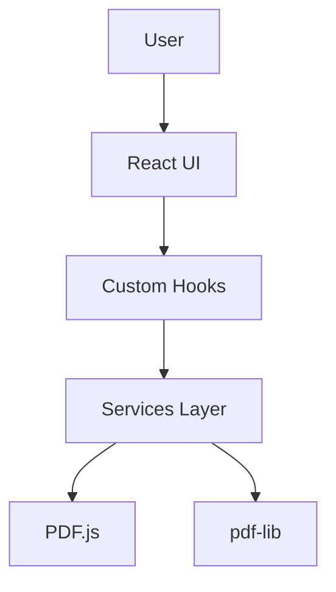

# Architecture Documentation

This directory contains system architecture documentation including high-level design, diagrams, and component relationships.

## Contents

| File | Description |
|------|-------------|
| [OVERVIEW.md](./OVERVIEW.md) | High-level system architecture, technology stack, and data flow |
| [SERVICES.md](./SERVICES.md) | Detailed documentation of all service modules |

## Purpose

Architecture documentation serves to:
- Explain the "big picture" of how the system works
- Guide developers on where to add new functionality
- Document system constraints and design decisions
- Provide visual diagrams for complex interactions

## Diagrams

Architecture diagrams are written in Mermaid.js format for easy maintenance and version control.

### Example Mermaid Diagram

## Creating Architecture Docs

When documenting architecture:

1. **Start with the "why"**: Explain the purpose before the implementation
2. **Use diagrams**: Visual representations help understanding
3. **Keep it updated**: Outdated architecture docs are dangerous
4. **Link to ADRs**: Reference decisions that shaped the architecture
5. **Include code examples**: Show how patterns are used

## Related Documentation

- [../adrs/](../adrs/) - Architecture Decision Records
- [../ADR/](../ADR/) - Legacy Architecture Decision Records
- [../specs/](../specs/) - Feature Specifications
- [../TECHNICAL_SPEC.md](../TECHNICAL_SPEC.md) - Technical implementation details
